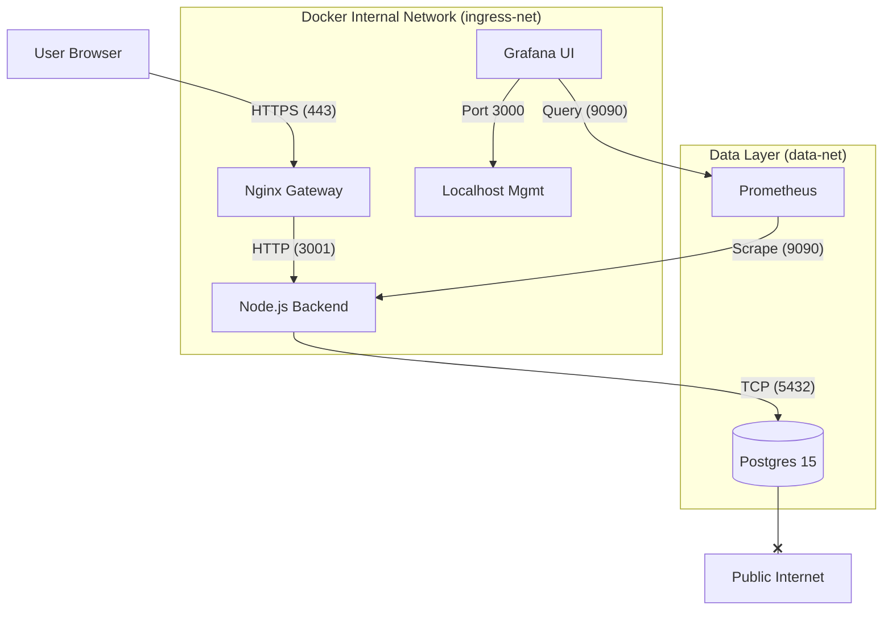

# OpsGuard System Architecture

## 1. Overview
**OpsGuard** (formerly User-IP-Viewer) is a secure, geo-aware web application designed for privacy, immutability, and AI-driven analysis. It is deployed as a single containerized unit (`Dockerfile.combined`) but composed of distinct underlying services.

### Core Philosophy: "Hardened by Design"
- **Ingress-Only**: The backend and database are **not** exposed to the public internet directly. All traffic is routed through a TLS-terminating Nginx Ingress.
- **Data Sovereignty**: Usage of Local AI (Ollama) is prioritized for sensitive data, with Cloud AI (Gemini) as a fallback/performance option.
- **Immutability**: The code artifact built in CI is unique. It travels from Dev -> Prod unchanged.

---

## 2. Infrastructure Diagram (Docker Compose)
The system runs as a composition of **4** primary services on the Host (Dell Latitude E7270):

### Key Components
1.  **Nginx (Ingress)**: Handles SSL/TLS. Proxies api requests to `app:3001`. Serves static frontend assets.
2.  **App (Node.js)**: Runs the business logic, API, and serving of the React SPA.
    - **Frontend**: Vite-built SPA, served statically by Express fallback.
    - **Backend**: Express API, AI Integration, DB logic.
3.  **DB (Postgres)**: Persistent storage for visit history. Isolated on `data-net`.
4.  **Observability**: Prometheus (Collector) & Grafana (Visualizer).

---

## 3. Observability Strategy (The "Why")
We do not collect metrics just to have "charts". We collect data to answer specific questions.

### A. The RED Method (Backend Health)
Standard industry practice for microservices.
1.  **Rate (RPS)**: *How busy are we?*
    - **Metric**: `http_requests_total`
    - **Value**: Sudden spikes indicate surges or attacks. Zero means downtime.
2.  **Errors**: *Are we failing?*
    - **Metric**: `http_requests_total{status=~"5.."}`
    - **Value**: 5xx errors mean code failures or DB outages. We alert on this > 1%.
3.  **Duration (Latency)**: *Are we slow?*
    - **Metric**: `http_request_duration_seconds`
    - **Value**: High latency drives users away. We track 95th percentile.

### B. AI-Specific Metrics (The "Special Sauce")
Since OpsGuard relies on Hybrid AI, measuring AI performance is critical.
1.  **AI Request Count**: *Who is doing the work?*
    - **Metric**: `ai_requests_total{provider="gemini|ollama"}`
    - **Value**: Tracks cost (Gemini is paid/quota) vs Sovereign (Ollama is free/private).
2.  **AI Latency**: *Is local AI too slow?*
    - **Metric**: `ai_analysis_duration_seconds`
    - **Value**: On a CPU-only host (E7270), Ollama can be slow. If latency > 10s, we might need to fallback to Cloud.
3.  **Success Rate**: *Is the AI hallucinating/failing?*
    - **Metric**: `ai_requests_total{status="error"}`
    - **Value**: High error rates might mean API key issues (Gemini) or model crashes (Ollama).

---

## 4. Best Practices Checklist
- [x] **Strict Networks**: DB has `internal: true`. It cannot dial out.
- [x] **Ephemeral Secrets**: Tokens (`OPSGUARD_TOKEN`) are generated at startup or injected via secure env vars.
- [x] **Health Checks**: Every service exposes `/healthz` or equivalent. Container orchestration relies on this.
- [x] **Release Gates**: Code is not shipped unless it passes `scripts/release-qualify.sh` (which includes 5+ checks: Isolation, Smoke, AI Probe).
