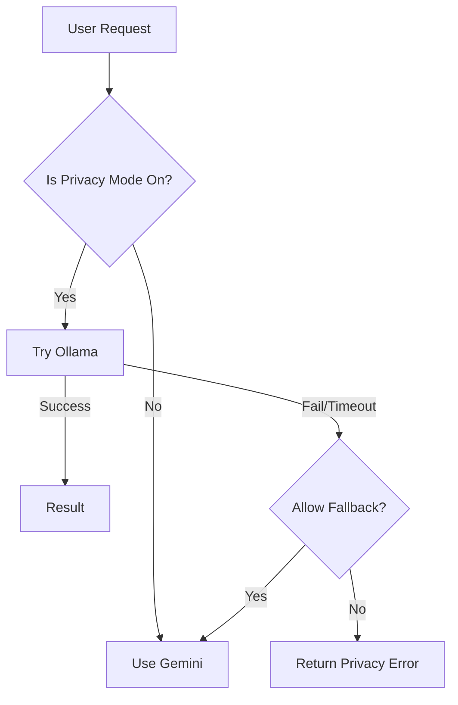

# Hybrid AI Architecture

OpsGuard employs a unique "Hybrid AI" strategy to resolve the tension between **Data Privacy** and **Analytical Power**.

> [!TIP] 🎧 Audio Deep Dive
> <a href="/opsguard_context.md" download class="VPCard" style="display:inline-block; padding: 6px 12px; background-color: var(--vp-c-brand); color: white; border-radius: 4px; text-decoration: none; margin-bottom: 10px;">📥 Download Source File</a>
>
> **Step 1**: Download the source above.
> **Step 2**: Upload to [NotebookLM](https://notebooklm.google.com/).
> **Step 3**: Copy & Paste this prompt:
> Putting "Two Brains" in one app?
> 1. Upload `OPSGUARD_FULL_CONTEXT.md` to **NotebookLM**.
> 2. Paste this prompt:
>    > "Focus entirely on the **Hybrid AI Strategy**. Explain the tension between Privacy (Ollama) and Intelligence (Gemini). Walk through the routing logic diagram mentally for the listener. Discuss the trade-offs of using CPU-only local inference vs cloud APIs."

## 🧠 The "Two Brains" Concept
Instead of relying on a single AI provider, we route tasks based on their sensitivity and complexity.

### 1. The Local Brain (Ollama)
- **Role**: The "Privacy Guardian".
- **Location**: Runs directly on the Dell Latitude host (outside the container, accessed via host networking).
- **Model**: Typically `llama3` or `mistral`.
- **Use Case**:
    -   Analyzing sensitive IP addresses that we don't want to leak to Google.
    -   Basic pattern recognition (e.g., "Is this IP structure valid?").
    -   Offline operation.

### 2. The Cloud Brain (Google Gemini)
- **Role**: The "Heavy Lifter".
- **Location**: Google Cloud (Vertex AI / AI Studio).
- **Model**: `gemini-pro`.
- **Use Case**:
    -   Complex threat analysis requiring vast internet knowledge.
    -   Summarizing long history logs.
    -   Fallback when the local host is overloaded.

## 🔀 The Routing Logic
The decision is made in `server/services/aiService.js`:

## ⚠️ Key Challenges & Solutions

### Latency
- **Problem**: Running LLMs on a CPU-only laptop (E7270) is slow.
- **Solution**: We implemented extensive timeouts and a "Stream" response mode so the user sees progress immediately, rather than waiting 30s for a blank screen.

### Standardization
- **Problem**: Ollama output varies slightly from Gemini output.
- **Solution**: We use "Prompt Engineering" to enforce a JSON schema on both providers, ensuring the frontend always receives the same structure (`{ riskScore, analysis, location }`).
