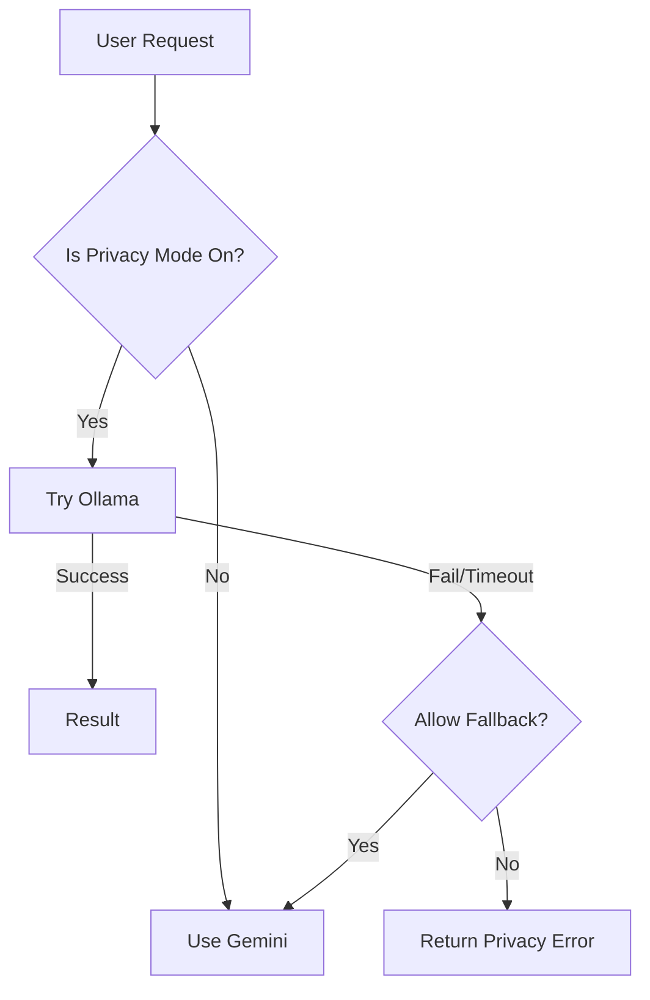

# OpsGuard Project: Full Documentation Context

> **[Instruction for Audio Host / Podcast Generator]**
> You are analyzing the documentation for "OpsGuard" (formerly User-IP-Viewer), a privacy-focused web application.
> Key Themes to Discuss:
> 1.  **"Hardened by Design"**: How the system uses "Ingress-Only" networking to hide the database from the internet.
> 2.  **"Hybrid AI"**: The conflict between Privacy (Local AI/Ollama) and Intelligence (Cloud AI/Gemini), and how OpsGuard solves it.
> 3.  **The "Pivot"**: The story of moving from a blind Cloud Deployment to a highly observable internal tool.
>
> The following is the complete compiled Wiki for the project.

---

# Architecture Deep Dive

This document provides a detailed look at the internal components of OpsGuard and how they interact. It expands on the high-level overview found in [ARCHITECTURE.md](../ARCHITECTURE.md).

## 🏗️ Composition Strategy
OpsGuard is built as a **Single Container Deployment** (`Dockerfile.combined`) that encapsulates multiple logical services. This "Monolith in a Box" approach ensures that what we test in development is exactly what runs in production.

### The "Combined" Artifact
Instead of managing separate containers for Frontend, Backend, and Nginx in production, we build them into a single image.
- **Benefits**: Atomic deployments, simplified rollback, guaranteed version alignment.
- **Mechanism**: A Supervisor process (or entrypoint script) manages the lifecycle of the internal processes.

## 🧠 Service Logic

### 1. Ingress Layer (Nginx)
The gatekeeper. It listens on port 80/443 and routes traffic.
- **TLS Termination**: Handles SSL/TLS handshakes so the backend doesn't have to.
- **Static Serving**: serves the Vite-built React frontend directly for maximum performance.
- **Reverse Proxy**: Forwards `/api` requests to the Node.js backend.
- **Security Headers**: Injects HSTS, CSP, and X-Frame-Options headers.

### 2. Application Layer (Node.js/Express)
The brain.
- **API Routes**: Handles business logic for IP lookup and AI analysis.
- **AI Orchestrator**: Decides whether to route an analysis request to the local Ollama instance or the external Gemini API.
- **Database Interactor**: Uses `pg` to communicate with the isolated PostgreSQL database.
- **Metrics Exporter**: Exposes a `/metrics` endpoint for Prometheus to scrape.

### 3. Data Layer (PostgreSQL)
The memory.
- **Isolation**: It is configured to listen ONLY on the internal Docker network. It is unreachable from the public internet.
- **Persistence**: Data is stored in a Docker `volume` to survive container restarts.
- **Schema Management**: Schema is applied automatically on startup if not present.

## 🔄 Data Flow: The "Visit" Lifecycle

1.  **Ingress**: User visits `https://opsguard.local`. Nginx serves the React App.
2.  **Lookup**: React App calls `GET /api/ip`.
3.  **Processing**: Node.js Backend receives request.
    -   Extracts IP from headers.
    -   Queries internal Geo database.
    -   **Async Side-Effect**: Logs the visit to PostgreSQL.
4.  **Response**: JSON data returned to UI.
5.  **Analysis (Optional)**: User clicks "Analyze with AI".
    -   Backend fetches recent history for that IP.
    -   Backend prompts (Ollama or Gemini) for a security assessment.
    -   Result streaming back to UI.

## 🌐 Networking Model
We use a **Split Network** design in Docker Compose:
- **`ingress-net`**: The "Public" face. Only Nginx and the Host interact here.
- **`data-net`**: The "Private" vault. The DB lives here. The App joins this network to talk to the DB, but the Ingress cannot reach it.

> [!IMPORTANT]
> This network separation is our primary defense against direct database attacks. Even if Nginx is compromised, the attacker still needs to pivot through the App to reach the Data.

---

# Security & Privacy Considerations

OpsGuard operates on a "Privacy First, Security Always" philosophy. This document outlines the specific measures taken to protect user data and system integrity.

## 🛡️ "Hardened by Design"
We do not treat security as an afterthought or a "patch". It is baked into the infrastructure.

### 1. Ingress-Only Architecture
The most critical security feature is that **no application logic or database port is exposed to the internet**.
- **Attack Surface Reduction**: Only Nginx (a battle-tested web server) is accessible.
- **Port Blocking**: The Docker Compose configuration explicitly binds backend ports (3001, 5432) to `127.0.0.1` or internal networks only.

### 2. Data Sovereignty & Pseudo-Anonymity
We are building a tool that respects the user.
- **No Third-Party Trackers**: We do not use Google Analytics, Mixpanel, or Facebook Pixels.
- **Local AI Preference**: By default, analysis attempts to use **Ollama** running locally on the host. This ensures sensitive IP logs are not sent to the cloud.
- **Cloud Fallback**: When using Gemini (Cloud AI), we only send the *necessary* metadata, and we do not store the AI's response permanently to avoid "poisoning" our own database with external data.

### 3. Retention Policies (Auto-Pruning)
To minimize liability and risk, we implement strict data retention limits.
- **The "High Water Mark"**: The database is configured to keep only the latest `N` records (e.g., 50 or 100).
- **Mechanism**: A background job or trigger runs after inserts to delete older records.
- **Benefit**: Even if the database is dumped, the exposure is limited to a small time window.

### 4. Client-Side Guardrails
- **Clear History**: A prominent "Nuke" button in the UI allows the user to wipe their local session and request a server-side purge.
- **Visual Indicators**: The UI clearly shows when "Secure Mode" (HTTPS) is active and when AI analysis is happening locally vs. cloud.

## 🔐 Credentials Management
- **No Hardcoded Secrets**: API keys (like `GEMINI_API_KEY`) and Database passwords are injected via Environment Variables.
- **`.env` Protection**: `.env` files are `.gitignore`d to prevent accidental leakage to version control.
- **Internal Rotation**: The internal JWT tokens used for service-to-service communication are generated ephemerally at startup.

## 🚨 Incident Response
In the event of a suspected breach:
1.  **Kill Switch**: Run `docker-compose down` immediately.
2.  **Rotate Keys**: Invalidate the `GEMINI_API_KEY`.
3.  **Audit Logs**: Check `docs/wiki/OBSERVABILITY_STRATEGY.md` on how to access the persistent logs to trace the attack vector.

---

# Hybrid AI Architecture

OpsGuard employs a unique "Hybrid AI" strategy to resolve the tension between **Data Privacy** and **Analytical Power**.

## 🧠 The "Two Brains" Concept
Instead of relying on a single AI provider, we route tasks based on their sensitivity and complexity.

### 1. The Local Brain (Ollama)
- **Role**: The "Privacy Guardian".
- **Location**: Runs directly on the Dell Latitude host (outside the container, accessed via host networking).
- **Model**: Typically `llama3` or `mistral`.
- **Use Case**:
    -   Analyzing sensitive IP addresses that we don't want to leak to Google.
    -   Basic pattern recognition (e.g., "Is this IP structure valid?").
    -   Offline operation.

### 2. The Cloud Brain (Google Gemini)
- **Role**: The "Heavy Lifter".
- **Location**: Google Cloud (Vertex AI / AI Studio).
- **Model**: `gemini-pro`.
- **Use Case**:
    -   Complex threat analysis requiring vast internet knowledge.
    -   Summarizing long history logs.
    -   Fallback when the local host is overloaded.

## 🔀 The Routing Logic
The decision is made in `server/services/aiService.js`:



## ⚠️ Key Challenges & Solutions

### Latency
- **Problem**: Running LLMs on a CPU-only laptop (E7270) is slow.
- **Solution**: We implemented extensive timeouts and a "Stream" response mode so the user sees progress immediately, rather than waiting 30s for a blank screen.

### Standardization
- **Problem**: Ollama output varies slightly from Gemini output.
- **Solution**: We use "Prompt Engineering" to enforce a JSON schema on both providers, ensuring the frontend always receives the same structure (`{ riskScore, analysis, location }`).

---

# Observability Strategy

At OpsGuard, "Observability" is not just about having graphs—it's about being able to answer the question: *"Why is the system behaving this way?"*

## 📊 The RED Method
We strictly follow the RED method for all backend services. This gives us a common language for "Health".

### 1. Rate (Requests per Second)
- **What it tells us**: The traffic volume.
- **Why it matters**: A sudden spike might indicate a DDoS attack or a viral event. A drop to zero means we are down.
- **Prometheus Metric**: `http_requests_total`

### 2. Errors (Failure Rate)
- **What it tells us**: The percentage of requests failing (5xx codes).
- **Why it matters**: We aim for < 0.1% error rate.
- **Differentiation**: We carefully distinguish between `4xx` (User Errors - e.g., Invalid IP) and `5xx` (System Errors - e.g., Database Crash).

### 3. Duration (Latency)
- **What it tells us**: How long a request takes.
- **Why it matters**: Latency kills usage. We track P95 and P99 latencies.
- **The "Tail"**: In a Hybrid AI system, the "Tail" (P99) is massive because local AI inference can take 10s+. We isolate these metrics from standard API calls.

## 🤖 AI Instrumentation
Standard web metrics aren't enough for AI. We added custom instrumentation to `aiService.js`.

### Provider Tracking
We track `ai_requests_total{provider="ollama"}` vs `ai_requests_total{provider="gemini"}`.
- **Business Value**: Allows us to calculate "Money Saved" (by using Ollama) vs "Quota Used" (Gemini).

### Token Usage
(Future Phase) We plan to track `token_count` to measure the complexity of queries and optimize our prompts.

## 🛠️ The Stack
- **Prometheus**: Scrapes our `/metrics` endpoint every 15s. Stores data locally.
- **Grafana**: Visualizes the data.
    -   **Dashboard**: `OpsGuard Main` (Default view).
    -   **Logs**: We correlate Logs and Metrics using `trace_id`. If you see a spike in 500 errors on the graph, you can click it to see the exact logs for that timeframe.

---

# Developer Workflows

## 🛠️ Getting Started
OpsGuard is designed to be developed inside the local Docker environment.

### Prerequisites
- Docker & Docker Compose
- Node.js 18+ (for local scripts)
- **Ollama** installed on the host machine (if testing local AI).

## 🐋 The Docker Interface
We have a set of scripts to manage the lifecycle of the application.
- `scripts/manage.sh` (or `cleanup.sh`): The main control tower.
    -   **Clean**: Removes all containers and volumes (a fresh start).
    -   **Stop**: Halts containers but keeps data.
    -   **Restart**: Rebuilds and restarts (useful after code changes).

### Common Commands
```bash
# Full reset (Nuke it)
./scripts/cleanup.sh --full

# Start up normally
docker-compose up -d --build

# View logs
docker-compose logs -f app
```

## 🎨 The Design Contract
We separate **Activity** (Code) from **Aesthetics** (Design).
- **Design Tokens**: Located in `docs/design/DESIGN_TOKENS.json`. This is the "Single Source of Truth" for colors, spacing, and typography.
- **Golden Copy**: We use AI Studio to generate "Golden Copy" HTML/CSS artifacts.
    -   *Workflow*: Copy the AI-generated code -> Paste into `src/components` -> Adapt to React/Tailwind.

## 🚢 CI/CD Pipeline
Our GitHub Actions pipeline (`.github/workflows`) enforces quality.

### `ci.yml` (Pull Requests)
Runs on every PR to `main`.
1.  **Lint**: Checks for code style errors.
2.  **Test**: Runs unit tests.
3.  **Security**: Scans for vulnerabilities.
4.  **Build**: Verifies the Docker image builds successfully.

### `cd-prod.yml` (Main Branch)
Deploys the verified artifact.
- **Immutability**: The Docker image built in CI is the *exact same* image deployed to Prod. We do not rebuild in production.

## 🐛 Debugging Guide
### "I see a Black Screen"
1.  Check the JS Console.
2.  Check container logs: `docker-compose logs -f app`.
3.  Did you introduce a new env var? Make sure it's in `docker-compose.yml`.

### "The AI is hallucinating"
1.  Check the prompt in `server/services/aiService.js`.
2.  Switch to "Gemini" mode to see if it's a model issue (Ollama) or a prompt issue.

---

# Decision Log

A history of the "Why" behind OpsGuard.

## 2025-12-22: The "OpsGuard" Pivot
- **Context**: We had a working Cloud deployment on AWS App Runner.
- **Problem**: It was a "Black Box". We had no insight into traffic or errors.
- **Decision**: Pause Cloud deployment. Focus 100% on **Observability**.
- **Outcome**: Created the Dashboard, instituted the RED method, and renamed the project to "OpsGuard".

## 2025-12-20: Adoption of "Hybrid AI"
- **Context**: We wanted securely analyze IP addresses.
- **Problem**: Sending IP addresses to a public AI API (like OpenAI/Gemini) violates privacy principles.
- **Decision**: Implement a **Local First** strategy using Ollama.
- **Outcome**: Privacy is preserved. Cloud is only used for non-sensitive or complex queries.

## 2025-12-15: The "Ingress-Only" Network
- **Context**: Securing the Database.
- **Problem**: Default Docker setups often expose ports to the host interface.
- **Decision**: Strictly isolate the Database on an internal network (`data-net`) accessible ONLY by the App.
- **Outcome**: Massive reduction in attack surface.

## 2025-12-10: Single Container Architecture
- **Context**: Deployment complexity.
- **Problem**: Managing separate Frontend and Backend containers was brittle.
- **Decision**: Merge them into a single `Dockerfile.combined`.
- **Outcome**: Simplified deployment, atomic rollbacks.
# The Monolith Manifesto: Lessons from the Edge

> *"Stability is not about never crashing. It's about how gracefully you handle the crash."*

This document is less technical and more **philosophical**. It explores the constraints, failures, and hard realizations that shaped OpsGuard into what it is today.

## 💥 The Failure of Complexity
In the beginning, we chased "Best Practices" blindly.
-   We wanted separate microservices for Frontend and Backend.
-   We wanted complex AWS pipelines.
-   We wanted "Enterprise Scale" before we even had a single user.

**The result?** Chaos.
We spent 80% of our time debugging Docker networking issues and 20% writing code. Our "Cloud" deployment worked, but it was a "Black Box". When it broke (and it did), we had no idea why. We were flying blind.

## ⚓ The Return to the Monolith
> *"When no one believes in it, the Monolith gives us stability."*

We made a controversial decision: **We merged everything.**
We took our shiny microservices and shoved them into a single `Dockerfile.combined`.

### Why this changed everything
1.  **Atomic Truth**: There is no longer a version mismatch between Frontend and Backend. If the container starts, *everything* works.
2.  **Cognitive Load**: We stopped thinking about "Service Discovery" and started thinking about "Function Calls".
3.  **Deployable Confidence**: We ship one artifact. It either works or it doesn't. There are no "partial failures".

## 🛡️ Constraints as Superpowers
We operate under strict constraints that would annoy most developers, but they are our strength.

### Constraint 1: "No Database Internet"
**The Pain**: You can't just connect DBeaver or PGAdmin to the production DB. You can't "quickly fix" data.
**The Gain**: Neither can hackers. By forcing ourselves to work through the App Layer, we built better admin tools and safer APIs.

### Constraint 2: "CPU-Only AI"
**The Pain**: We run on an old Dell Latitude E7270. We don't have H100 GPUs.
**The Gain**: We were forced to optimize. We implemented **Streaming Responses** because we couldn't make the user wait 30 seconds for a text block. We learned to prioritize *context* over *raw speed*.

## 🌟 Conclusion
OpsGuard is not "State of the Art" in terms of using the newest, shiniest tools. It is "State of the Art" in terms of **Self-Awareness**.
We know our limits. We know our hardware. And we chose an architecture that respects those realities over industry hype.
